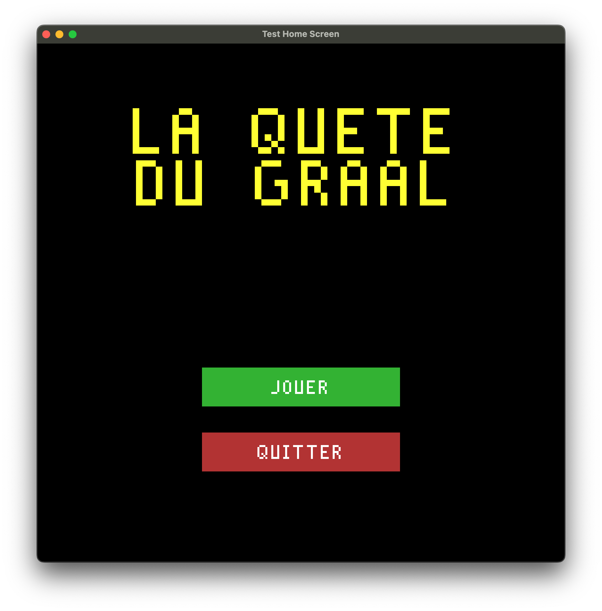
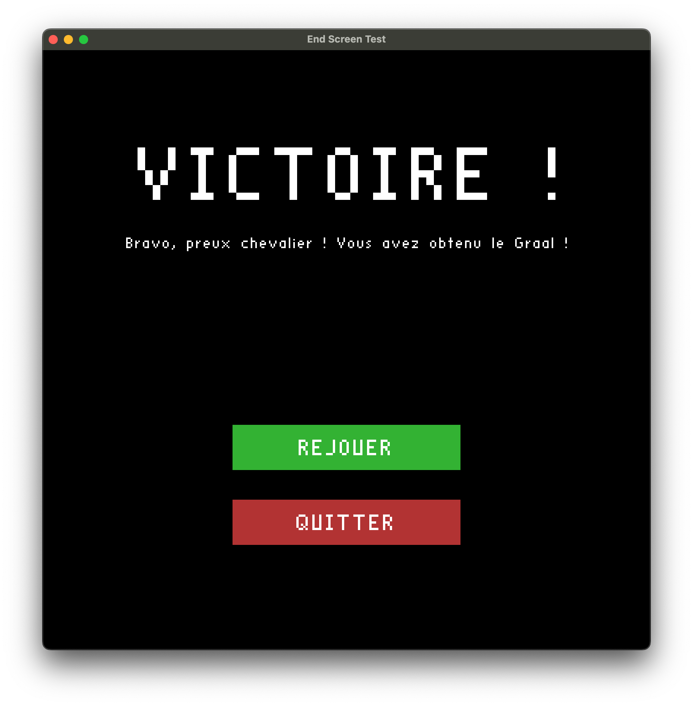
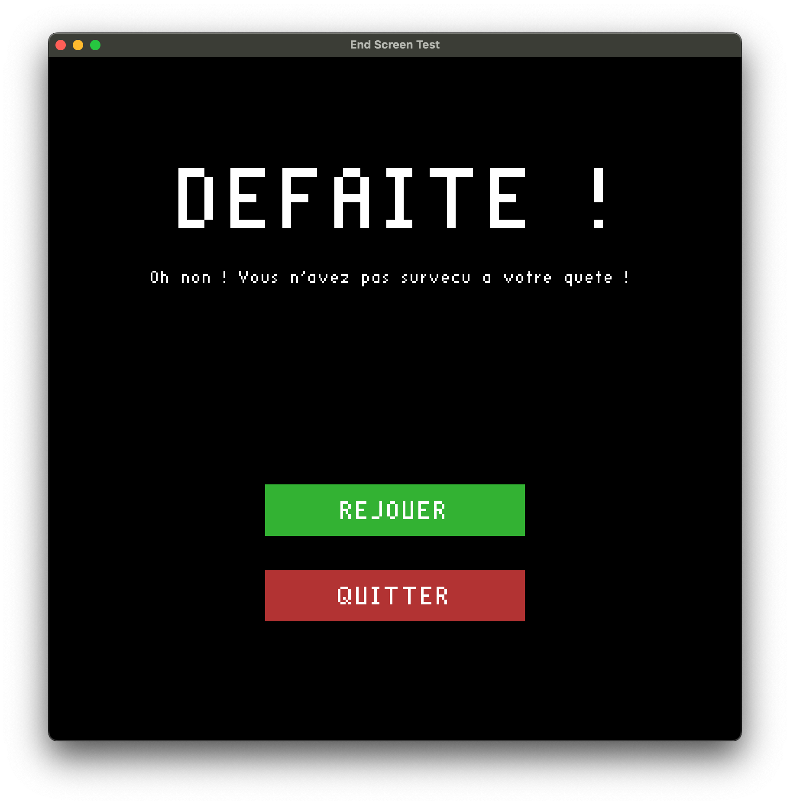
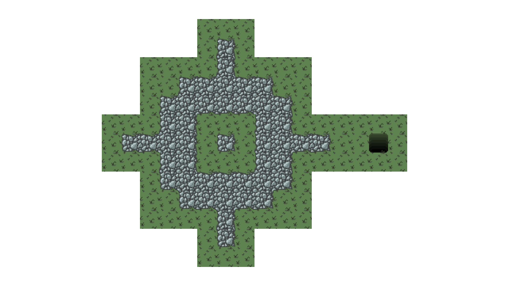

# Rapport du projet : La Quête du Graal

## 1. Thème du jeu
La Quête du Graal est un jeu d’aventure en 2D où le joueur incarne un chevalier à la recherche du Graal.

## 2. Fonctionnalités implémentées

### a. Génération de la carte
Carte générée procéduralement avec murs, zones accessibles, trésors, pièges et un Graal unique.
Algorithme de cellular automata (version améliorée) pour la structure de la carte.
Placement aléatoire mais contrôlé des objets (aucun sur la position de départ).

### b. Règles du jeu
Le joueur commence sur une case sûre (ni mur, ni piège, ni trésor, ni Graal).
Objectif : trouver et atteindre le Graal pour gagner.
Si le joueur tombe sur un piège, il perd.
Des clés sont à ramasser avant d'accéder au Graal.

### c. Écrans et interface
Écran d’accueil avec boutons "JOUER" et "QUITTER".



Écran de victoire ("VICTOIRE !") si le Graal est atteint.



Écran de défaite ("DEFAITE !") si le joueur tombe dans un piège.
Boutons "REJOUER" et "QUITTER" sur l’écran de fin.



Affichage du titre, des messages et des boutons avec OpenGL et la bibliothèque libre stb_easy_font.

### d. Contrôles
Déplacement du joueur avec les touches directionnelles (à préciser).
Souris pour cliquer sur les boutons des écrans d’accueil et de fin.

## 3. Guide d’utilisation

### Règles et commandes
À l’accueil : cliquez sur "JOUER" pour commencer, "QUITTER" pour sortir.

En jeu : déplacez le chevalier avec les flèches du clavier.
Objectif : trouvez le Graal sans tomber dans un piège.

Exemple de textures du sol :


Fin de partie : cliquez sur "REJOUER" pour recommencer, "QUITTER" pour quitter.

## 4. Structure du code
```bloc.cpp/hpp``` : structure des cases de la carte.
```default_value.cpp/hpp``` : valeurs globales (dimensions, etc).
```main.cpp``` : point d’entrée, initialisation du jeu.
```map_gen.cpp/hpp``` : génération de la carte et placement des objets.
```draw.cpp/hpp``` : affichage du jeu.
```end_screen.cpp/hpp``` : gestion de l’écran de fin.
```home_screen.cpp/hpp``` : gestion de l’écran d’accueil.

## 5. Améliorations possibles
...